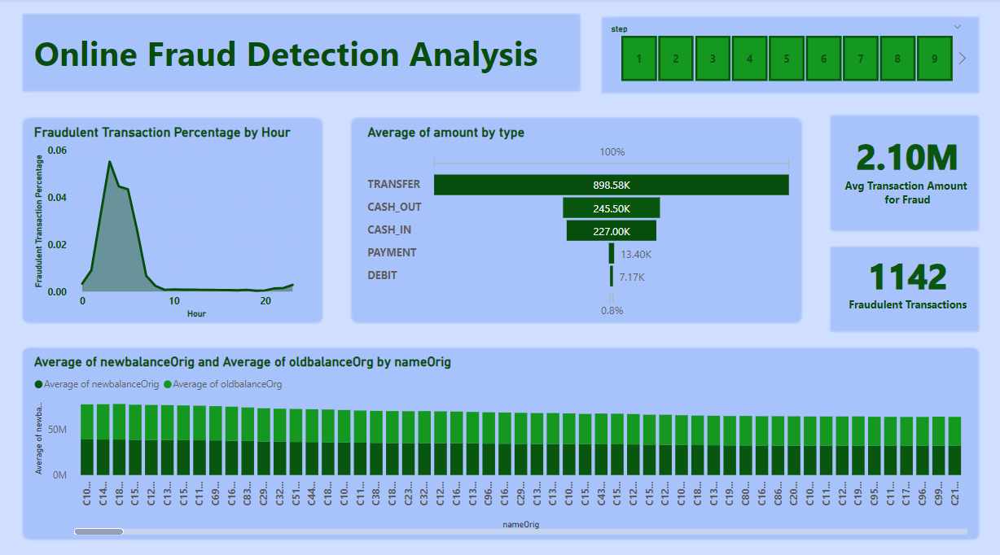
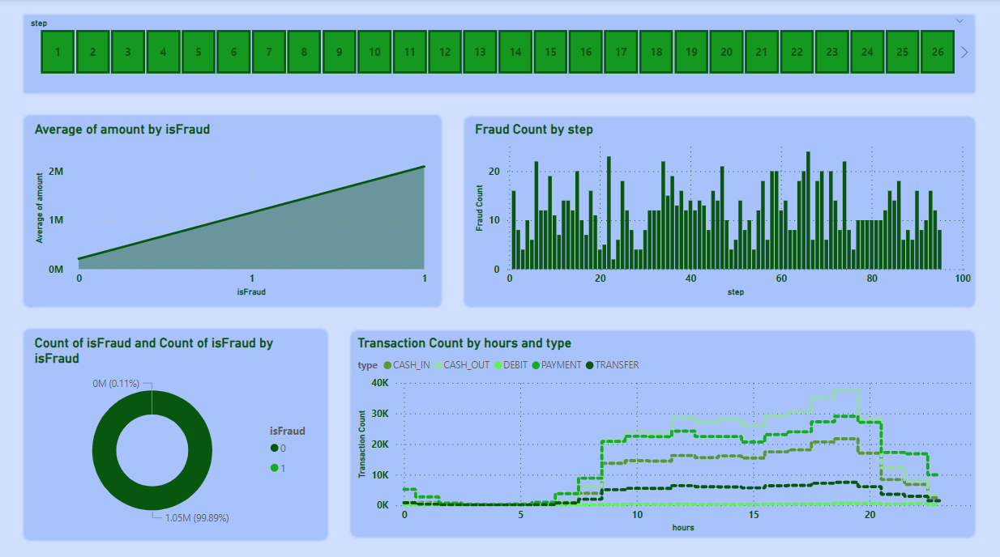
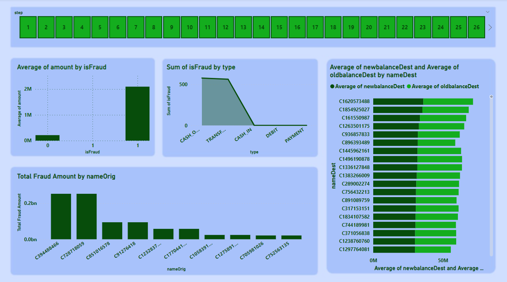

# Unmasking Online Fraud: Leveraging Machine Learning for Enhanced Detection and Prevention 🕵️‍♂️💻

## Introduction 🌟
In the ever-evolving digital realm, online payment systems have become an indispensable part of our lives. The sheer convenience of making transactions at our fingertips is truly remarkable, but with great convenience comes great responsibility! Yes, the risk of online payment fraud has surged hand in hand. Fear not! Join me on an exhilarating internship journey where I ventured into the realm of machine learning to develop an innovative project laser-focused on online payment fraud detection. In this engaging blog, I will unveil the process of building a robust and intelligent system that fortifies security and instills trust in every online transaction. Let's dive in! 🚀

## My Journey at pickl.ai 🎓🚀
My rendezvous with Pickl.ai's learning programs has been nothing short of transformative. It all started with a captivating machine learning course that ignited my passion for the Data Science field. In this data-driven world, Data Science paves the way for progress, driving innovations across industries, optimizing products and services, and elevating overall efficiency and competitiveness. When the golden opportunity to partake in a Data Science internship program at Pickl.ai knocked on my door, I couldn't resist! It was an unparalleled chance to deepen my knowledge and gain hands-on insights into the Data Science realm. The carefully curated, intensive program led us on a fascinating journey of learning, blending theory with practical hands-on sessions. The interactive live sessions added a delightful touch, enriching our understanding of applying our newfound knowledge to real-world challenges. Skills we honed included mastering Excel, Python Basics, Object-Oriented Programming, Statistics, Numpy, Pandas, Visualization using Python, Tableau, SQL, Data Exploration, Data Selection, Data Cleaning, and of course, the pièce de résistance - Machine Learning! 📚🔍

## Need for Online Payment Fraud Detection 🛡️💸
Before embarking on any project, understanding the problem's essence and its relevance is paramount. Let's delve into the imperative need for payment fraud detection:
- **Increasing Online Transactions:** The rise of e-commerce and online services has resulted in an exponential surge in online transactions. As the digital realm thrives, it beckons miscreants seeking to exploit vulnerabilities in payment systems for their nefarious gains.
- **Sophistication of Fraud Techniques:** Fraudsters are the ultimate shape-shifters! Their tactics evolve incessantly, employing sophisticated methods to circumvent traditional security measures.
- **Financial Loss Prevention:** Online payment fraud entails massive financial losses, affecting both businesses and consumers alike. Staying one step ahead of these scammers is the need of the hour!
- **Reputation Protection:** A business that falls victim to payment fraud risks enduring reputational damage, causing customers to lose faith and trust. Building and safeguarding trust is the bedrock of success!
- **Customer Trust and Confidence:** By ensuring an impregnable payment environment, businesses can forge unshakeable trust and confidence among their customers, leading to enduring loyalty and word-of-mouth referrals! 🌟🌐🤝

## My Approach for the Project 🎯💡
1. **Understanding the Topic:** Embarking on the journey with curiosity ablaze, I delved deep to grasp the problem's intricacies and objectives. A thorough exploration of the dataset unearthed the key features, the target variable, and potential challenges lurking in the shadows.

2. **Handling Null Values:** Embracing the quest for perfection, I conducted meticulous checks to identify any missing values in the dataset. Alas, the dataset shone in all its glory - free of null values!

3. **Feature Engineering:** Armed with an eye for innovation, I transformed object data types into numerical representations, fostering compatibility with machine learning models. A dash of feature extraction unveiled meaningful insights hidden within the features.

4. **Handling Non-Gaussian Distribution:** Confronted by non-Gaussian distributions, I harnessed the power of apt techniques to metamorphose them into the graceful dance of Gaussian distributions.

5. **Outlier Handling:** On my relentless pursuit of precision, I unearthed outliers lurking in the data. Swiftly, I employed the capping method to tame these outliers, restoring the harmony of the dataset.

6. **Handling Imbalanced Dataset:** A dauntless crusader against class imbalance, I laid my hands upon diverse techniques to restore equilibrium to the dataset. The dance of:
   - Undersampling: Balancing the scales by reducing the majority class.
   - Oversampling: Empowering the minority class by increasing its presence.
   - SMOTE (Synthetic Minority Over-sampling Technique): Conjuring synthetic samples for the minority class.

7. **Model Training and Evaluation:** Armed with an arsenal of balanced datasets, I set out to train separate machine learning models. Fueled by passion, I evaluated their performance, meticulously analyzing metrics like accuracy, precision, and recall. The culmination of this rigorous analysis bestowed upon me the revelation that the art of oversampling proved the ultimate path to victory! 🏆📊🤩

With this systematic approach, I unearthed invaluable insights and flawlessly prepared the data for model training. The art of handling null values, feature engineering, and outlier handling elevated the data quality to unparalleled heights. My armory of class imbalance techniques paved the way for mighty models that aced their journey to conquer the target variable. The enchanting symphony of different models serenaded my senses, leading to the triumphant choice of oversampling as the champion! Armed with knowledge, innovation, and unwavering resolve, I emerged victorious in the realm of online payment fraud detection!

## Dashboard

